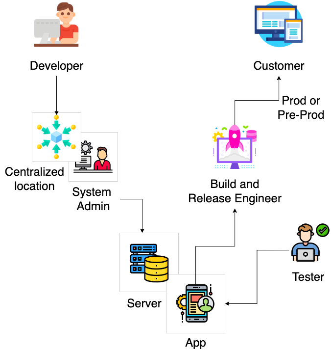

## DevOps

    Culture that improves the organization to delivery the application

## CI/CD - Continuous Integration / Continuous Delivery

- Improve delivery

- Automation

- Quality

- Monitoring

- Testing

---

### Devops is process of improving delivery of proper automation, improving quality, continuous monitoring and testing

---

## Traditional Approach

In a traditional approach, these three roles System Administrators, Server Administrators, and Build and Release Engineers are actively involved in delivering a product to the customer.

- `System Administrators` ensure that the systems and infrastructure needed to run the product are in place and functioning properly. They ensure that the servers, databases, and other components are properly configured, secure, and available to the development and operations teams.

- `Server Administrators` ensure that the servers used to host the product are properly configured and maintained. They also ensure that the servers have the necessary resources, such as storage and memory, to run the product.

- `Build and Release Engineers` are responsible for taking the code from development and making it ready for production. They automate the build process, test the code, and deploy it to the servers. They also monitor the performance of the product in production, troubleshoot issues, and make updates as needed.

Together, these roles work to ensure that the product is delivered to customers in a timely, efficient, and reliable manner. They coordinate their efforts to ensure that the product is deployed correctly, runs smoothly, and is easily maintainable.
