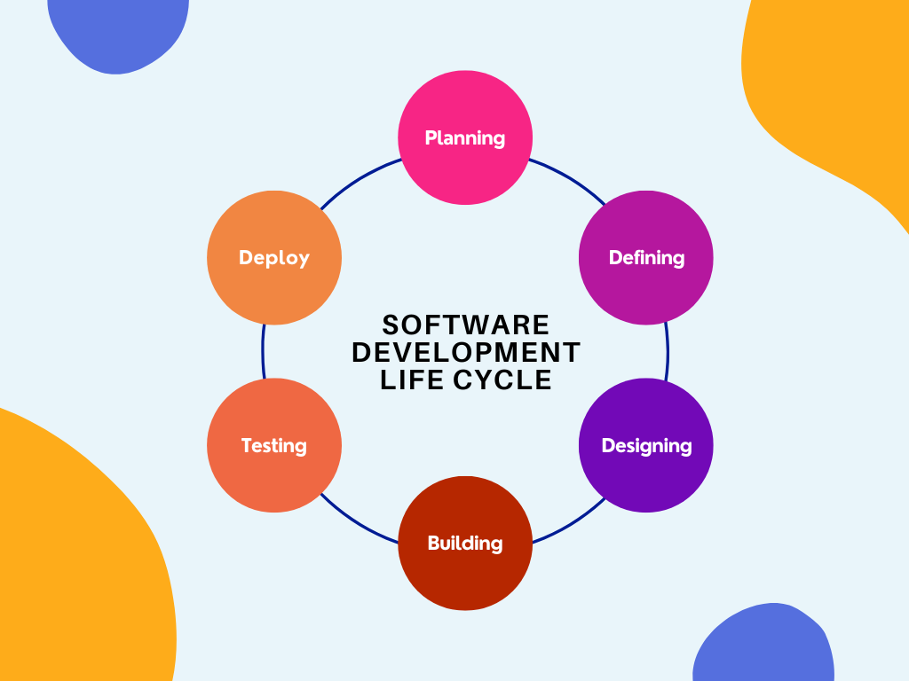

## Software Development Life Cycle

It is a methodology used in the development of software systems, which includes a series of phases that are followed in order to create and deliver a high-quality software product. 
  
 ---
 
 
 
 ---
 
### 1. Planning: 

It involves setting goals and objectives for the software development project, identifying the stakeholders and end-users, and creating a project plan outlining the tasks and timelines for the project.

### 2. Defining: 

In this phase, the development team works to create a detailed understanding of the software system that is being developed. This includes gathering requirements, creating user stories, and creating a detailed requirements document that will serve as the basis for the rest of the development process.

### 3. Designing: 

In this phase, the development team uses the information gathered in the previous phase to create a detailed design of the software system. This includes creating diagrams and flowcharts to illustrate the different components of the system and how they will interact with each other.

### 4. Building: 

This phase is similar to the Implementation phase of the traditional SDLC. It involves the actual coding and construction of the software, using the design created in the previous phase.

### 5. Testing: 

The testing phase is where the development team evaluates the software to ensure that it meets the requirements and specifications outlined in the requirements document. This includes both functional and non-functional testing to ensure that the software performs as intended and is free of bugs or errors.

### 6. Deploy: 

Once the software has been tested and is determined to be functional, it is deployed to the end-users. This may include installing the software on users' computers, configuring it for the specific environment, and providing training and support.

