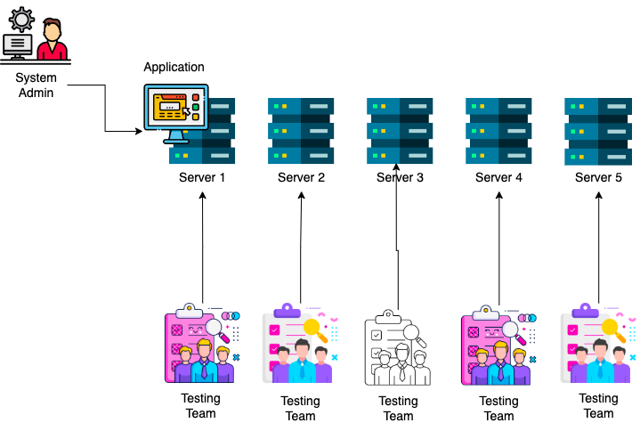

## 1. What is a server

A server is a computer or system that provides a service to other computers or devices, known as clients, over a network. Servers are typically more powerful and have more storage capacity than client computers, and they are designed to handle a large number of requests and handle them efficiently. There are many different types of servers, each with a specific purpose, such as:

- `File servers`: store and manage files that can be accessed by multiple users over the network.
- `Web servers`: host websites and deliver web pages to clients that request them.
- `Database servers`: store and manage large amounts of data and provide access to it for other applications.
- `Application servers`: run specific applications, such as email or collaboration software, and provide access to them for client devices.
- `Print servers`: manage and distribute print jobs to printers connected to the network.

Servers can be physical computers or virtual machines that run on a host computer. Some servers can also be run on cloud computing platforms, such as Amazon Web Services or Microsoft Azure.

---
## Physical Server 

Physical servers are actual, physical computers that are dedicated to running one or more server applications. They have their own processors, memory, storage, and network interfaces. They can be housed in a data center or on-premises, and they are typically managed by an IT team.

We bought five physical servers with 100GB RAM and 100 cores each to host our application. 

The system administrator deployed the application on the server, utilizing only 4GB RAM and 4 cores. During testing, different teams were assigned separate servers, but the application only used 4GB RAM and 4 cores. This resulted in 90% of the resources remaining unused.

DevOps is responsible for ensuring efficient resource utilization.

Here comes the conpects of Vitualization

## Virtual Server

Virtual servers, on the other hand, are software-based emulations of physical servers. They are created and run on a physical host using a hypervisor, which allows multiple virtual servers to share the host's resources. Virtual servers have their own virtualized hardware and run their own operating systems, but they are not physically separate from the host.

### Hypervisor 

A hypervisor is a piece of software that allows multiple operating systems to run on a single physical host. It creates and manages virtual machines (VMs), which are software-based emulations of physical computers. The hypervisor sits between the physical host's hardware and the guest operating systems, and it allows the VMs to share the host's resources, such as CPU, memory, and storage. 

